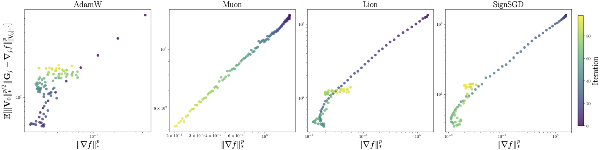

# Heavy-tailed-Noise-in-LLMs
This is the experiment code for [Sign-based Optimizers Are Effective Under Heavy-tailed Noise](https://arxiv.org/abs/2602.07425)

## Quickstart 

To reproduce our results, you can follow the routine here:

1. clone our repo

```sh
git clone https://github.com/Dingzhen230/Heavy-tailed-Noise-in-LLMs.git
cd Heavy-tailed-Noise-in-LLMs
```

2. Create a conda environment and install dependencies:

```sh
conda create -n env python=3.10
conda activate env
pip install -r requirements.txt
```

3. Get the C4 dataset ready for training

```sh
mkdir datasets
python ./src/data/c4.py
```

> Note that since training a 124m nanoGPT with 20x tokens only consume a small portion of C4 dataset, we only download and tokenize part of the full dataset. But we are sure that similar results would be observed if you run on full C4 dataset.

4. Pretrain nanoGPT with all the optimizers:

```sh
mkdir results
bash ./scripts/train_all.sh
```

This procedure will pretrain nanoGPT with all the optimizers(Adam, Muon, Muonlight, SignSGD, Lion) and get the ckpts ready for noise analysis in `./results`

5. Analyse the noise and gradient during training:

```sh
bash ./scripts/noise.sh
```

This procedure will load each ckpt, iterate several steps, and at each step the code will estimate the expectation of $g - \nabla f$, and then record the relationship between $\lVert \nabla f(x_i) \rVert^p$ and $\lVert g_i - \nabla f(x_i) \rVert^p$

6. Produce the plot

Download all the csv files of your wandb runs, then use the `process_all` function in `plot/plot_fig.ipynb` to produce the result.

We've conducted expriment on the parameters at the `c_attn` of nanoGPT, and validated our noise model proposed in the article that there exists a linear relationship between $\lVert \nabla f(x_i) \rVert^p$ and $\lVert g_i - \nabla f(x_i) \rVert^p$:



## Parameters

Here are the possible parameters you can use for noise analysis:

```python
# --- noise --- #
parser.add_argument("--mode", default="train", type=str) # training or noise analyse
parser.add_argument("--save_cnt", default=5, type=int) # Count of ckpts saved during training
parser.add_argument("--sample_itr", default=50, type=int) # How many iterations you want to test at each ckpt
parser.add_argument("--layer_type", default="attn", type=str) # which layer's gradient to fetch, attention or embedding
```

For more detailed parameters setting for model pretraining, you can refer to `src/config/base.py`, or `README` in [llm-optimizer-benchmark](https://github.com/epfml/llm-optimizer-benchmark)

## Using WandB

The project relies on wandb to save the outcome and record the results. You need to give your wandb authorize key in order to send the data to your wandb account. If you start jobs on a server without access to prompt, then you can set the `WANDB_API_KEY` variable within your script:

```bash
# this is a script that could be executed on a server
pip install -r requirements.txt # install req.
export WANDB_API_KEY="put your authorize key here, to find it: https://wandb.ai/authorize"
```

## Reference
If you find our work helpful, feel free to cite

```bibtex
@article{yu2026signheavytails,
  title={Sign-Based Optimizers Are Effective Under Heavy-Tailed Noise},
  author={Yu, Dingzhi and Tao, Hongyi and Wan, Yuanyu and Luo, Luo and Zhang, Lijun},
  journal={arXiv preprint arXiv:2602.07425},
  year={2026}
}
```

## Acknowledgements

This project is heavily based on [llm-optimizer-benchmark](https://github.com/epfml/llm-optimizer-benchmark).

The tail-index estimator `alpha_estimator` is borrowed from [sgd_tail_index](https://github.com/umutsimsekli/sgd_tail_index)

We gratefully acknowledge their work and contributions to the open-source community.
